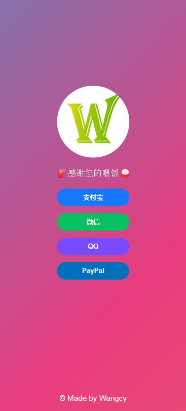

# 简介
| 完全使用```html```构成<br>
参考了[idealclover](https://donate.idealclover.cn/#showqrcode)的界面UI

---
# 显示效果
### 桌面设备显示效果

### 移动设备显示效果


---
# 使用方法
### 1. 内容修改
在```index.html```文件修改下面的字段：
```html
<a class="button paypal" href="https://www.paypal.com/paypalme/wangcy350?locale.x=zh_XC" target="_blank">PayPal</a>
<!--修改PayPal首款链接-->
            alipay: {
                title: "支付宝扫一扫",
                qrCode: "public/QRcode/Alipay.jpg",
                openUrl: "alipays://platformapi/startapp?appId=10000007&qrcode=https://qr.alipay.com/FKX15240TMKBTPVUNBW32E0"
            },
            wechat: {
                title: "微信扫一扫",
                qrCode: "public/QRcode/WeChat.jpg",
                openUrl: "wxp://f2f0gO6SgxgNkrt3bJ9o7nAai4WEIEqbF2EpABKYuhv4e9brXNMF_izplpfeeHH-8CAK"
            },
            qq: {
                title: "QQ扫一扫",
                qrCode: "public/QRcode/QQ.jpg",
                openUrl: "https://i.qianbao.qq.com/wallet/sqrcode.htm?m=tenpay&a=1&u=810779522&ac=CAEQgofOggMYrv-5tAY4AEIgMWExOWRlYmIyYjMxMjY0MTA0MTQ3ODhkZDlhNDk2ZDA%3D_xxx_sign&n=%E5%B1%B9%C2%A0 %C2%A0 %C2%A0&f=wallet"
            }
        };
<!--修改剩余三个图标和付款跳转-->
```
其中```openurl```的跳转链接是通过对收款码进行解码后得到的，你可以使用例如[草料二维码解码器](https://cli.im/tools)进行查询
### 2. 图标修改
个人logo在路径```public/images```中修改
收款二维码字段```qrCode```在路径```public/QRcode```中修改
